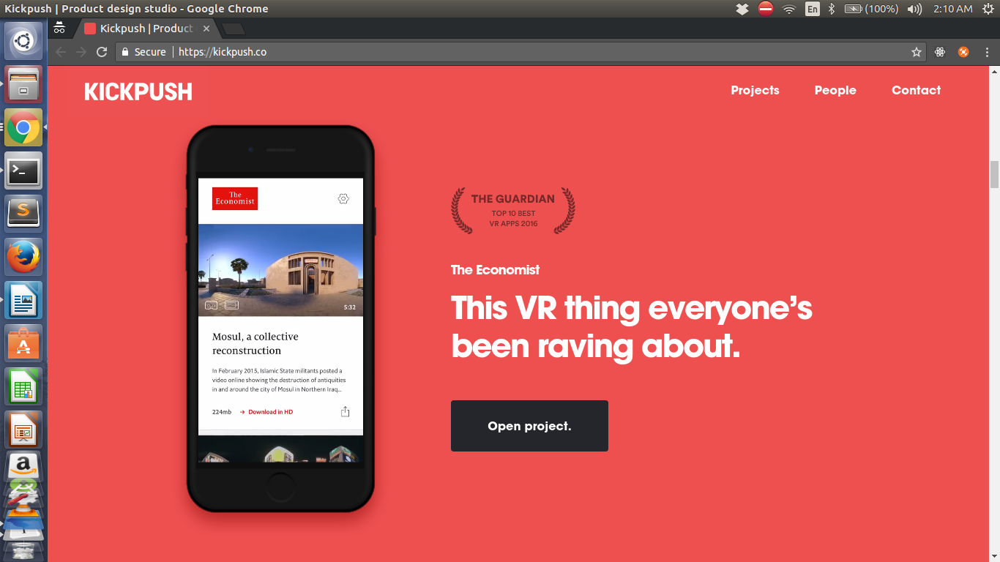
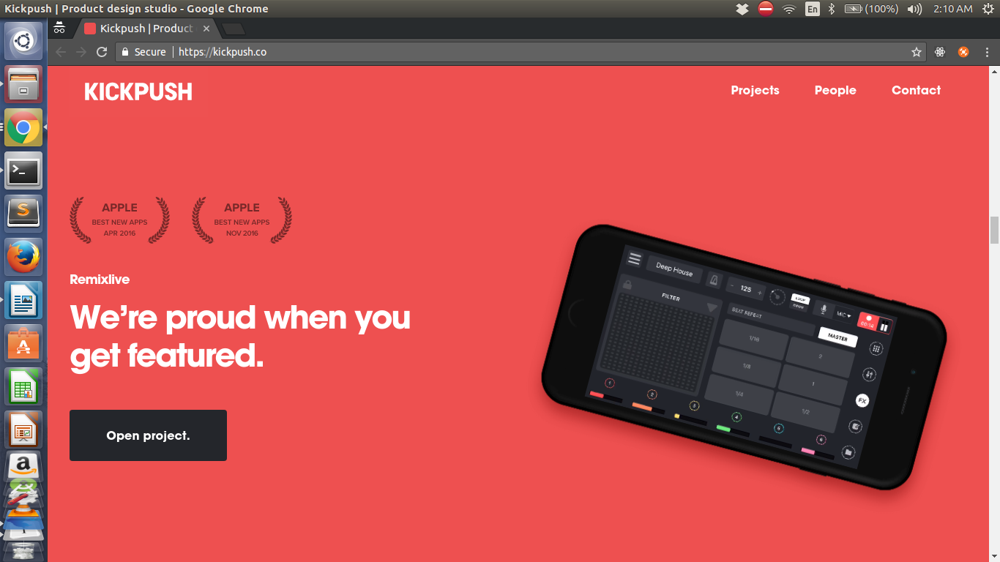

# Demo

This is a demo folder. Your personal portfolio can consist of a README file as well.

### Tips

1. If your portfolio is hosted somewhere make sure you provide a link in the README.
2. Make sure you add screenshots of your portfolio to the README

### Example

Your README can look like 

### John Doe

I am a web developer based out of Antarctica which is why I am so cool. You can learn more about me at  [johndoe.com](https://www.example.com) 

**Note**: Images sourced from [kickpush](https://kickpush.co/)